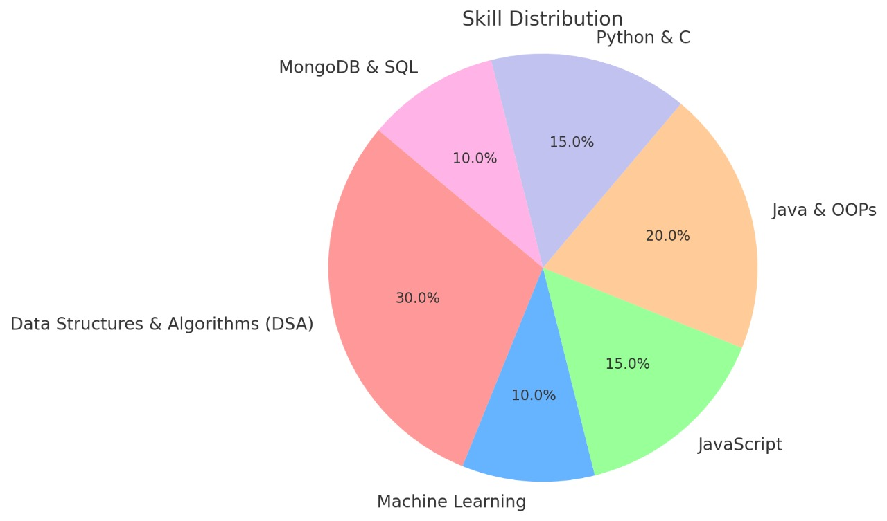

# premsai
# 👋 Hi there, I'm Premsai Sigalampatla

🎓 B.E. Computer Science Engineering Student | Neil Gogte Institute of Technology  
🌱 Enthusiastic about solving real-world problems using AI/ML, Data Science, and Java Development  
💡 Skilled in Java (OOPs), DSA, Python, C, SQL and MongoDB, with hands-on experience in Deep Learning, Web Scraping, NLP.

---

## 🛠️ Projects I’ve Worked On

🔍 **Intellijobs: Automating Job Portal Scraping and Analysis with LLMs**  
*Python, BeautifulSoup, Selenium, NLP, LLMs*  
- Automated job scraping from multiple job portals using Python & Selenium  
- Applied LLMs to extract skills, technologies, and job trends  
- Performed data analysis and visualization of job insights

🖱️ **Enhancing Human-Computer Interaction via Multimodal Cursor Control**  
*Python, OpenCV, MediaPipe, PyAutoGUI, SpeechRecognition, Eye Tracking*  
- Built a contactless interface using hand gestures and eye movements  
- Mapped gestures to control the mouse using PyAutoGUI  
- Enhanced accessibility using voice and eye-tracking-based navigation

---

## 📊 My Skill Distribution

---

## 💻 Technical Skills

**Languages:** Java, Python, C, HTML/CSS, JavaScript, SQL  
**Developer Tools:** VS Code, Eclipse, Google Cloud Platform, BlueJ  
**Technologies/Frameworks:** Linux, Jenkins, GitHub, JUnit, WordPress  

---

## 🏆 Achievements & Extras

- 🥇 Winner – NGIT Hackathon (2024, 2025)  
- 🥇 Winner – TechTone’24 Project Presentation  
- 🎯 Active on LeetCode, GitHub  
- 🎮 Hobbies: Cricket, movies, video editing

---

## 📬 Let's Connect

- 📧 Email: sigalampatlapremsai@gmail.com  
- 🔗 [LinkedIn](https://linkedin.com/in/premsai)  
- 💻 [GitHub](https://github.com/premsai)

---

## 📈 GitHub Stats

